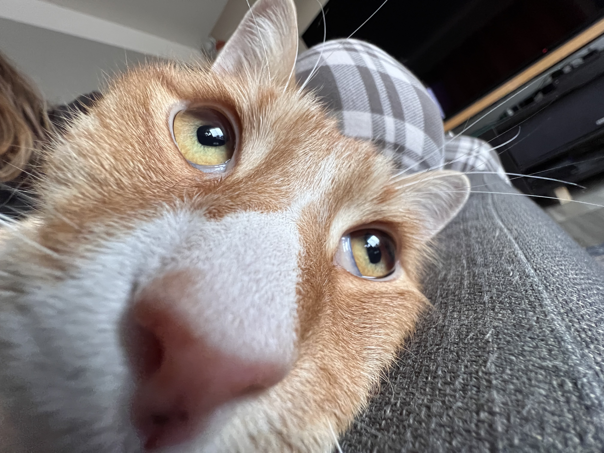

### Кислова Ольга 

Цветовод-любитель, лингвист-переводчик, репетитор английского языка. "Мать" трех черных котов из породы Дворовых дворян =) и мальтийского "баллона". В данный момент изучаю программирование на языке Swift, нраицца. Опыта в программировании не имею, хотя по мнению свекрови являюсь "уже программистом" , потому что могу настроить тв-приставку =)

Навыки:  
- Знание иностранных языков
- Вовлечение в учебный процесс обучающихся
- Умение находить индивидуальный подход 

